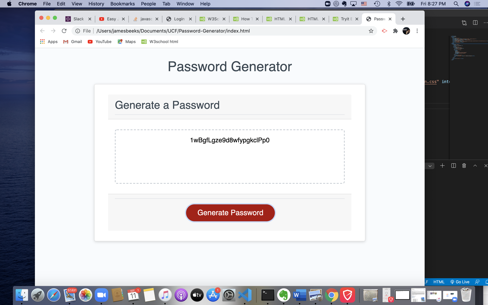

# Password-Generator
Had some issues with pulling my assigment into my vcs but finally got it to work
Added bootstrap link style.css link.
Added arrays under assignment code
Added all characters for the generator to generate
added confirmation variables
added function generate password
Added array and combined array syntax
Had a mental block until study group.
came up with new code.
found an isNAN property that is cool and added it
Created prompts for for loops and if prompts no else was needed

## Summary
This was a challenging assigment, but I began to understand as I studied more into it. The study groups did help a lot and I am encouraged as I'm not alone. All functions are working properly as is required in the assignment.  

### Screenshot 

